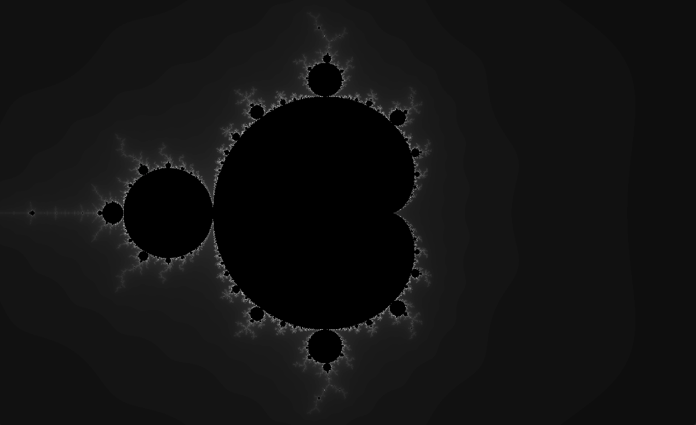

# Mandlebrot Set With P5.JS Grayscale

- The Mandelbrot sets the set of complex numbers {\displaystyle c}c for which the function {\displaystyle f_{c}(z)=z^{2}+c}{\displaystyle f_{c}(z)=z^{2}+c} does not diverge when iterated from {\displaystyle z=0}z=0, i.e., for which the sequence {\displaystyle f_{c}(0)}{\displaystyle f_{c}(0)}, {\displaystyle f_{c}(f_{c}(0))}{\displaystyle f_{c}(f_{c}(0))}, etc., remains bounded in absolute value. 

- Its definition is credited to Adrien Douady who named it in tribute to the mathematician Benoit Mandelbrot, a pioneer of fractal geometry.

- Images of the Mandelbrot set exhibit an elaborate and infinitely complicated boundary that reveals progressively ever-finer recursive detail at increasing magnifications, making the boundary of the Mandelbrot set a fractal curve. The "style" of this repeating detail depends on the region of the set being examined.

- Tutorial on Youtube channel Coding Train

